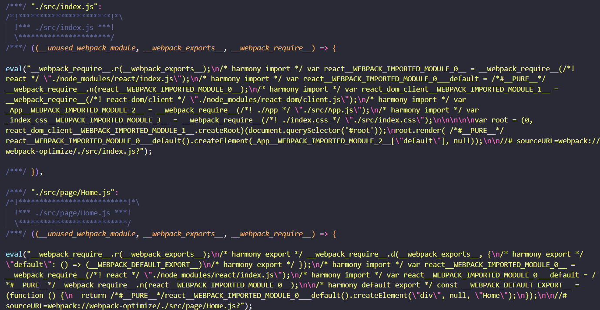
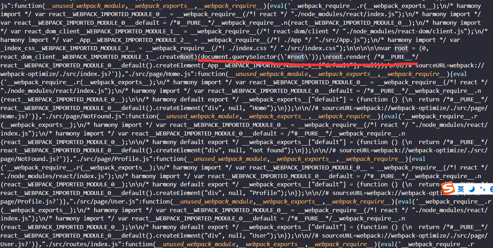

### 1. 压缩js
```shell
npm i terser-webpack-plugin -D
```




### 2. 提取css文件 压缩
```shell
npm i mini-css-extract-plugin -D
npm i css-minimizer-webpack-plugin -D
# npm i purgecss-webpack-plugin -D
```

[mini-css-extract-plugin](https://github.com/webpack-contrib/mini-css-extract-plugin) 单独提取css
[css-minimizer-webpack-plugin](https://github.com/webpack-contrib/css-minimizer-webpack-plugin)
<!-- [purgecss-webpack-plugin](https://www.npmjs.com/package/purgecss-webpack-plugin) -->

### 3. Tree Shaking
 
```js
module.exports = {
  mode:'production',
  module: {
    rules: [
      {
        test: /\.js/,
        include: path.resolve(__dirname, "src"),
        use: [
          {
            loader: "babel-loader",
            options: {
            presets: [["@babel/preset-env", { "modules": false }]],
          },
        },
      ],
    }
  }
}
```

### 4. 代码分割

1. 多入口

```js
entry: {
  main: './src/index.js',
  other: './src/other/index.js'
}
```

2. 动态加载&懒加载

```js
import React, { lazy} from "react"
import Home from '../page/Home'
import User from '../page/User'
import NotFound from '../page/NotFound'
const Profile = lazy(() => import('../page/Profile.js'))

const routes = [
  { path: '/', element: <Home /> },
  { path: '/profile', element: <Profile /> },
  { path: '/user', element: <User /> },
  { path: '*', element: <NotFound /> }
]
export default routes

<Suspense fallback={'loading'}>
  <Router />
</Suspense>
```

3. preload 预先加载

```js
import(
  `./utils.js`
  /* webpackPreload: true */
  /* webpackChunkName: "utils" */
)
```

4. prefetch 预先拉取

```js
import(
  `./utils.js`
  /* webpackPrefetch: true */
  /* webpackChunkName: "utils" */
)
```

5. preload & prefetch 

preload 是告诉浏览器页面必定需要的资源，浏览器一定会加载这些资源，而 prefetch 是告诉浏览器页面可能需要的资源，浏览器不一定会加载这些资源
所以建议：对于当前页面很有必要的资源使用 preload,对于可能在将来的页面中使用的资源使用 prefetch

6. 提取公共代码

### 5. CDN

最影响用户体验的是网页首次打开时的加载等待。 导致这个问题的根本是网络传输过程耗时大，CDN的作用就是加速网络传输。
CDN 又叫内容分发网络，通过把资源部署到世界各地，用户在访问时按照就近原则从离用户最近的服务器获取资源，从而加速资源的获取速度
用户使用浏览器第一次访问我们的站点时，该页面引入了各式各样的静态资源，如果我们能做到持久化缓存的话，可以在 http 响应头加上 Cache-control 或 Expires 字段来设置缓存，浏览器可以将这些资源一一缓存到本地
用户在后续访问的时候，如果需要再次请求同样的静态资源，且静态资源没有过期，那么浏览器可以直接走本地缓存而不用再通过网络请求资源

**缓存配置**
  - HTML文件不缓存，放在自己的服务器上，关闭自己服务器的缓存，静态资源的URL变成指向CDN服务器的地址
  - 静态的JavaScript、CSS、图片等文件开启CDN和缓存，并且文件名带上HASH值
  - 为了并行加载不阻塞，把不同的静态资源分配到不同的CDN服务器上

**域名限制**
 - 同一时刻针对同一个域名的资源并行请求是有限制
 - 可以把这些静态资源分散到不同的 CDN 服务上去
 - 多个域名后会增加域名解析时间
 - 可以通过在 HTML HEAD 标签中 加入去预解析域名，以降低域名解析带来的延迟

```js
output: {
  publicPath: "xxxxx.com/xxx",
}
```

